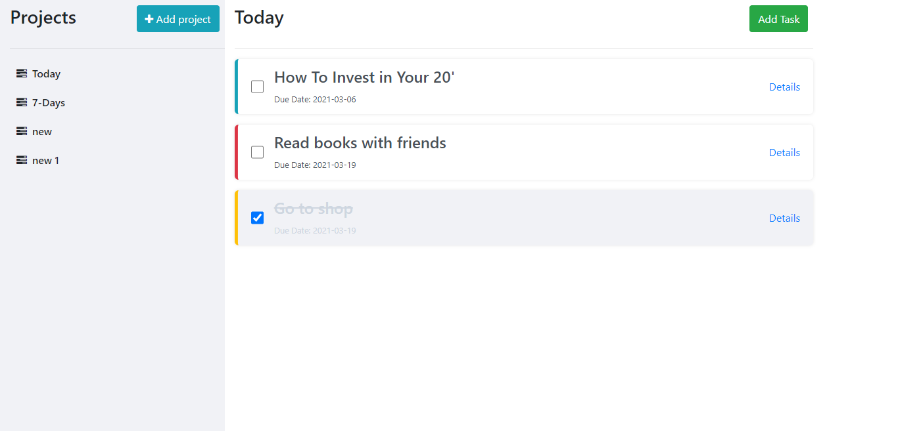

# Todo app

> Todo list is a simple project for keeping track of your Todo's for different projects. by using this app you can create a new project and you can add your todos in specific project of your choice.

## Features
 User can :
 - Create a new project
 - Create a new to do to the specific project
 - Update the todo
 - Delete the todo

## Built with
- Javascript
- Webpack
- HTML
- Css
- Bootstrap
- Local storage

## Getting Started

- Clone the repo `git@github.com:dipbazz/todo-app.git`
- cd `into` the project
- Run `git pull origin todo-app`
- Run `yarn install` or `npm install` to install dependencies
- On the terminal run `npm run start` open up the live server

## Authors

👤 **Murodjon Tursunpulatov**

- Github: [@murodjon000](https://github.com/murodjon000)
- Twitter: [@MurodjonTursun5](https://twitter.com/MurodjonTursun5)
- Linkedin: [@Murodjon Tursunpulatov](https://www.linkedin.com/in/murodjon-tursunpulatov-5189481b3/)

👤 **Dipesh Bajgain**

- GitHub: [@dipbazz](https://github.com/dipbazz)
- Twitter: [@dipbazz](https://twitter.com/dipbazz)
- LinkedIn: [Dipesh Bajgain](https://www.linkedin.com/in/dipbazz/)

## 🤝 Contributing

Contributions, issues and feature requests are welcome!

Feel free to check the [issues page](issues/).

## Show your support

Give a ⭐️ if you like this project!

## 📝 License

MIT License